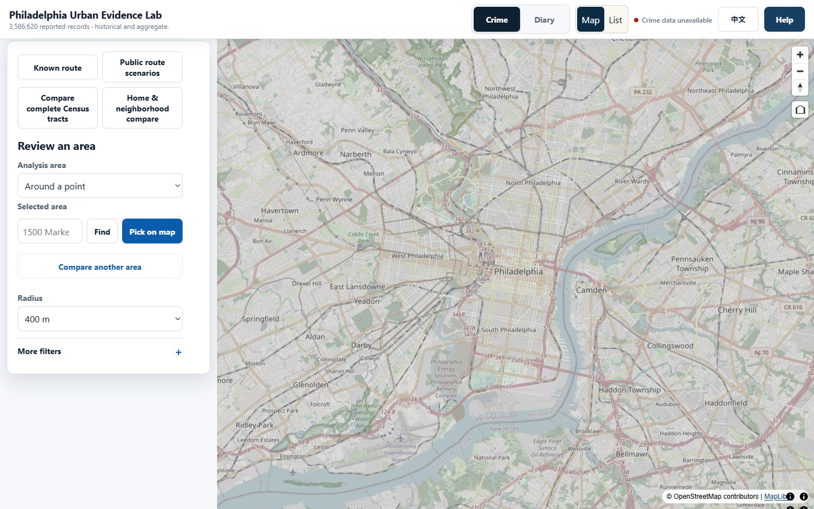
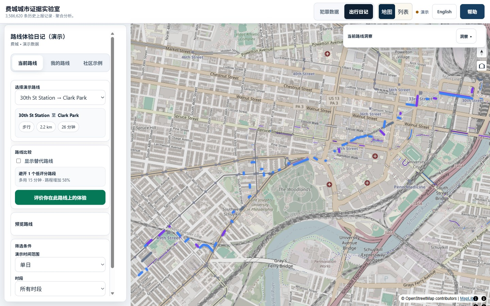

# Philadelphia Urban Evidence Lab（费城城市证据实验室）

中文 | [English](README.md)

[](https://github.com/raederhans/engagement-project/actions/workflows/ci.yml)
[](https://raederhans.github.io/engagement-project/)
[](package.json)
[](LICENSE)

这是一个支持中英文的费城城市数据项目。它把历史已报告事件、区域比较、已知路线背景和浏览器本地
出行记录放在同一个界面里，帮助用户更方便地查看和比较城市公开数据。

## 当前进度

- GitHub Pages 发布通过仓库 Windows 与 Linux 门禁的最新 `main` 版本；CI 徽章和链接的工作流是
  当前发布状态的依据。
- 项目包含区域趋势、住宅与社区比较、扩展后的已知路线证据、公共路线示例、浏览器本地 Diary
  演示，以及只用于研究的 Python/ML 模块。
- 当前保留的数据校验记录覆盖 **3,586,620 条已标准化的历史上报记录**，本地内容寻址证据包约
  **10.81 GB**。
- 预测功能仍为 **not-promoted（未晋级）**，预测结果保持 **unavailable（不可用）**；历史聚合数据
  可以正常查看。
- 所有事件与路线背景都是历史或聚合信息；界面不提供实时状况、个人风险或安全结论，也不推荐路线。
  Diary 与“社区示例”只保存在当前浏览器中，并且仅用于演示。

## 界面预览

下面两张图展示当前界面。图片直接保存在仓库中，README 使用相对路径引用，不依赖本地临时目录。





## 项目里现在有什么

### 犯罪数据探索

可以按点位、警察分局或人口普查区查看历史已报告事件。选择时间范围和犯罪类别后，可从地图、事件表、
摘要、月度趋势、类别图表和日期时段分布等角度查看结果。涉及人口比率时，系统使用 ACS 估计值，并保留
其误差范围。

### 完整人口普查区比较

可以比较两个或更多费城完整人口普查区，查看 2020–2024 ACS 人口估计及 90% 误差范围。输入使用
完整的 11 位人口普查区 GEOID。

### 区域趋势

该界面展示历史聚合数据的覆盖范围、排除项和空间处理方法。目前预测没有通过上线门槛，界面会同时展示
未通过的检查项。

### 住宅与社区比较

最新本地界面为 2–4 个费城住宅设计，可分别查看房产记录、评估与交易历史、市政记录、附近历史上报事件、
交通背景和数据质量。每个来源独立保留“可用、部分可用、不可用”状态。

当前公开构建暂未启用私人地址查询，只展示全市数据准备情况。分享链接只包含显示设置。

### 已知路线

可以在地图上绘制路线、输入途经点，或导入 GeoJSON LineString。界面会查看路线附近的历史已报告记录，
并分开展示道路中心线、High Injury Network、事故、无障碍和出行方式等背景。

### 公共路线示例

可以查看少量预先计算好的公共地标步行场景，并排比较时间、距离、历史暴露、数据时效、匹配质量和
不确定性。

### 路线体验日记

用户可以记录 1–5 分的个人出行体验、标签、备注和可选路段详情。条目、草稿和历史记录保存在当前
浏览器中，也可以导出备份。“社区示例”和替代路线是静态演示数据。

### 本地路线伴随工具与 ML 研究

开发者可以在本机路线引擎和证据包准备好后启用本地路线伴随工具。Python/ML 模块用于研究和评估，
可以产出评估与治理记录。

## 数据是怎样被处理的

```text
官方公共数据快照
  -> 版本化、标准化记录
  -> 内容与来源链路校验
  -> 聚合空间分析
  -> 冻结评估与“不晋级”门禁
  -> 浏览器界面
```

项目会区分“缺失、部分可用、含糊、未映射、不可用”和“零”；私人内容保留在本地浏览器中。

更完整的系统图和数据流见 [Portfolio v2](docs/PORTFOLIO_V2.md)；数据物化、镜像和恢复流程见
[Data Foundation operations runbook](docs/DATA_FOUNDATION_OPERATIONS_RUNBOOK.md)。

## 本地运行

需要 Node.js `^20.19.0` 或 `>=22.12.0`，以及 npm 10 或更高版本。

```bash
npm ci
npm run dev
```

打开 `http://localhost:5173/` 查看数据探索界面；打开
`http://localhost:5173/?mode=diary` 查看路线体验日记演示。

运行仓库核心验证：

```bash
npm run validate
```

最新本地集成还提供以下轻量、定向验证：

```bash
npm run test:mainline-m0-m6
npm run test:ml-m7
npm run test:mainline-m7
```

完整数据重建、镜像、恢复和灾备演练与这些轻量测试分开执行，并且需要对应的精确本地证据目录。

## 仓库结构

```text
src/                 浏览器应用与产品界面
ml/                  仅用于研究的 Python/ML 模块与合同
scripts/lib/         数据、证据、恢复、评估与门禁逻辑
scripts/data/        版本化数据结构与冻结协议
scripts/tests/       单元、合同、异常输入、浏览器与视觉检查
public/data/         可由浏览器读取的小型聚合数据
reports/             聚合评估、模型与来源链路报告
docs/                架构、运行手册、任务记录与治理说明
```

## 数据说明

- “已报告事件”来自费城警察局公开记录；地点泛化、Census 估计和空间归属都会带来不确定性。
- 项目主要用于查看历史数据和比较不同维度，详细方法与运行边界见下方文档。

更多运行边界见 [部署证据要求](docs/DEPLOY.md) 和 [参与贡献说明](CONTRIBUTING.md)。

## 许可证

项目原创软件采用 [MIT License](LICENSE)。第三方数据继续遵守各自来源的许可、保留和再发布条款。
