# Address/Selection UX Flow Audit

**Date:** 2025-10-20
**Purpose:** Document current interaction model for area selection (point buffer vs. district/tract polygons)
**Status:** ⚠️ Significant UX ambiguity and missing features identified

---

## Current Interaction Model

### User Steps (As-Implemented)

1. **Initial Load**
   - Map shows Philadelphia centered at `[-75.1652, 39.9526]` zoom 11
   - Districts choropleth renders (all 25 districts visible with color-coded counts)
   - Controls panel shows:
     - Address A text input (non-functional)
     - "Select on map" button
     - Radius dropdown (400m / 800m)
     - Admin Level dropdown (Districts / Tracts)
     - Offense Groups, Time Window, etc.

2. **Point Buffer Selection (Optional)**
   - User clicks "Select on map" button
   - Button text changes to "Cancel"
   - Cursor changes to crosshair
   - User clicks anywhere on map
   - Red marker appears at clicked location
   - Blue buffer circle (radius = 400m default) appears
   - Charts update to show buffer-based data (monthly series, top-N, heatmap)
   - Districts choropleth REMAINS VISIBLE (not filtered to buffer)

3. **Admin Level Switch**
   - User changes dropdown from "Districts" to "Tracts"
   - Choropleth switches to census tract boundaries
   - Tract colors based on population (or precomputed counts if available)
   - Buffer circle and marker (if present) REMAIN VISIBLE
   - Charts still use buffer (if center was set)

4. **Radius Change**
   - User changes radius from 400m to 800m
   - Charts refetch with new `radiusM` parameter
   - **Bug:** Buffer circle does NOT redraw (visual stays at 400m)

5. **Offense Group / Time Window Changes**
   - User selects groups or adjusts time window
   - Choropleth updates (colors recalculate)
   - Points layer updates (clustering/unclustered points)
   - Charts update
   - Buffer circle unaffected (only visual overlay)

---

## State Keys: Current Schema

### Location/Selection State

| Key | Type | Default | Mutated By | Consumed By | Notes |
|-----|------|---------|------------|-------------|-------|
| `addressA` | `string \| null` | `null` | [panel.js:38](../src/ui/panel.js#L38) | **NONE** | Dead code; no geocoding |
| `addressB` | `string \| null` | `null` | **NONE** | **NONE** | Placeholder for future |
| `selectMode` | `string` | `'idle'` | [panel.js:44, 49](../src/ui/panel.js#L44) | [main.js:128](../src/main.js#L128) map click handler | `'idle'` \| `'point'` |
| `centerLonLat` | `[number,number] \| null` | `null` | [main.js:130](../src/main.js#L130) | [buffer_overlay.js:4](../src/map/buffer_overlay.js#L4), [main.js:139](../src/main.js#L139) | WGS84 coords |
| `center3857` | `[number,number] \| null` | `null` | [store.js:59](../src/state/store.js#L59) `setCenterFromLngLat` | [charts/index.js:36-38](../src/charts/index.js#L36-L38) buffer queries | EPSG:3857 |
| `radius` | `number` | `400` | [panel.js:57](../src/ui/panel.js#L57) | [charts/index.js:36](../src/charts/index.js#L36), [main.js:139](../src/main.js#L139) | Meters |
| `adminLevel` | `string` | `'districts'` | [panel.js:91](../src/ui/panel.js#L91) | [main.js:70](../src/main.js#L70) | `'districts'` \| `'tracts'` |
| `per10k` | `boolean` | `false` | [panel.js:96](../src/ui/panel.js#L96) | [main.js:71](../src/main.js#L71) | Rate normalization toggle |

### Missing State Keys (Identified Gaps)

| Key | Type | Purpose | Why Needed |
|-----|------|---------|------------|
| `queryMode` | `'buffer' \| 'district' \| 'tract'` | Explicit mode selection | Disambiguate point buffer vs. area selection |
| `selectedDistrictCode` | `string \| null` | Active district ID (e.g., `'01'`) | Enable single-district filtering |
| `selectedTractGEOID` | `string \| null` | Active tract ID (e.g., `'42101980100'`) | Enable single-tract filtering |

---

## Code Map: File & Line Pointers

### (a) Address Input Handling

**Controls:**
- **HTML:** [index.html:34](../index.html#L34)
  ```html
  <input id="addrA" type="text" placeholder="Enter address (placeholder)" />
  ```
- **Event listener:** [panel.js:37-40](../src/ui/panel.js#L37-L40)
  ```javascript
  addrA?.addEventListener('input', () => {
    store.addressA = addrA.value;
    onChange();
  });
  ```
- **State mutation:** [panel.js:38](../src/ui/panel.js#L38) `store.addressA = addrA.value`
- **Consumer:** **NONE** (value never read)

**Status:** ⚠️ Non-functional (no geocoding API integration)

---

### (b) "Select on Map" Toggle

**Controls:**
- **HTML:** [index.html:35](../index.html#L35)
  ```html
  <button id="useCenterBtn">Select on map</button>
  ```
- **Hint text:** [index.html:37](../index.html#L37)
  ```html
  <div id="useMapHint" style="display:none;">Click the map to set A (center). Press Esc to cancel.</div>
  ```

**Event Flow:**

1. **Button click:** [panel.js:42-54](../src/ui/panel.js#L42-L54)
   ```javascript
   useCenterBtn?.addEventListener('click', () => {
     if (store.selectMode !== 'point') {
       store.selectMode = 'point';
       useCenterBtn.textContent = 'Cancel';
       if (useMapHint) useMapHint.style.display = 'block';
       document.body.style.cursor = 'crosshair';
     } else {
       store.selectMode = 'idle';
       useCenterBtn.textContent = 'Select on map';
       if (useMapHint) useMapHint.style.display = 'none';
       document.body.style.cursor = '';
     }
   });
   ```

2. **Map click (when selectMode === 'point'):** [main.js:127-147](../src/main.js#L127-L147)
   ```javascript
   map.on('click', (e) => {
     if (store.selectMode === 'point') {
       const lngLat = [e.lngLat.lng, e.lngLat.lat];
       store.centerLonLat = lngLat;
       store.setCenterFromLngLat(e.lngLat.lng, e.lngLat.lat);

       // Place marker
       if (!window.__markerA) {
         window.__markerA = new maplibregl.Marker({ color: '#ef4444' });
       }
       window.__markerA.setLngLat(e.lngLat).addTo(map);

       // Draw buffer circle
       upsertBufferA(map, { centerLonLat: store.centerLonLat, radiusM: store.radius });

       // Reset mode
       store.selectMode = 'idle';
       const btn = document.getElementById('useCenterBtn');
       if (btn) btn.textContent = 'Select on map';
       document.getElementById('useMapHint').style.display = 'none';
       document.body.style.cursor = '';

       refreshAll();
     }
   });
   ```

3. **Buffer circle drawing:** [buffer_overlay.js:3-14](../src/map/buffer_overlay.js#L3-L14)
   ```javascript
   export function upsertBufferA(map, { centerLonLat, radiusM }) {
     if (!centerLonLat) return;
     const circle = turf.circle(centerLonLat, radiusM, { units: 'meters', steps: 64 });
     const srcId = 'buffer-a';
     if (map.getSource(srcId)) {
       map.getSource(srcId).setData(circle);
     } else {
       map.addSource(srcId, { type: 'geojson', data: circle });
       map.addLayer({ id: 'buffer-a-fill', ... });
       map.addLayer({ id: 'buffer-a-line', ... });
     }
   }
   ```

**Status:** ✅ Functional (marker + buffer circle work)

**Missing:**
- Esc key listener to cancel ([main.js](../src/main.js) has no `keydown` handler)
- Buffer circle doesn't redraw when radius changes

---

### (c) Admin Level Switch

**Controls:**
- **HTML:** [index.html:60-63](../index.html#L60-L63)
  ```html
  <select id="adminSel">
    <option value="districts" selected>Districts</option>
    <option value="tracts">Tracts</option>
  </select>
  ```

**Event Flow:**

1. **Dropdown change:** [panel.js:90-93](../src/ui/panel.js#L90-L93)
   ```javascript
   adminSel?.addEventListener('change', () => {
     store.adminLevel = adminSel.value;
     onChange();  // debounced 300ms → refreshAll()
   });
   ```

2. **Rendering branch:** [main.js:70-78](../src/main.js#L70-L78)
   ```javascript
   if (store.adminLevel === 'tracts') {
     const merged = await getTractsMerged({ per10k: store.per10k });
     const { breaks, colors } = renderTractsChoropleth(map, merged);
     drawLegend(breaks, colors, '#legend');
   } else {
     const merged = await getDistrictsMerged({ start, end, types });
     const { breaks, colors } = renderDistrictChoropleth(map, merged);
     drawLegend(breaks, colors, '#legend');
   }
   ```

**Data fetching:**
- **Districts:** [choropleth_districts.js:11-22](../src/map/choropleth_districts.js#L11-L22) → `fetchByDistrict({ start, end, types })`
- **Tracts:** [tracts_view.js:12-44](../src/map/tracts_view.js#L12-L44) → `fetchTractsCachedFirst()` + `fetchTractStatsCachedFirst()`

**Rendering:**
- **Districts:** [render_choropleth.js:9-71](../src/map/render_choropleth.js#L9-L71)
- **Tracts:** [render_choropleth_tracts.js](../src/map/render_choropleth_tracts.js) (similar structure)

**Status:** ✅ Functional (toggle works, choropleth switches)

**Gaps:**
- No way to select SINGLE district/tract (always shows all)
- No highlighting of "active area"
- Buffer circle remains visible in area mode (visually confusing)

---

### (d) Radius Updates

**Controls:**
- **HTML:** [index.html:42-45](../index.html#L42-L45)
  ```html
  <select id="radiusSel">
    <option value="400">400 m</option>
    <option value="800">800 m</option>
  </select>
  ```

**Event Flow:**

1. **Dropdown change:** [panel.js:56-62](../src/ui/panel.js#L56-L62)
   ```javascript
   const radiusImmediate = () => {
     store.radius = Number(radiusSel.value) || 400;
     handlers.onRadiusInput?.(store.radius);  // ← CALLBACK NOT DEFINED
     onChange();
   };
   radiusSel?.addEventListener('change', radiusImmediate);
   radiusSel?.addEventListener('input', radiusImmediate);
   ```

2. **Callback definition:** [main.js:111](../src/main.js#L111)
   ```javascript
   initPanel(store, { onChange: refreshAll, getMapCenter: () => map.getCenter() });
   ```
   **Problem:** `onRadiusInput` handler NOT passed (only `onChange` and `getMapCenter`)

3. **Consumer (charts):** [charts/index.js:32-39](../src/charts/index.js#L32-L39)
   ```javascript
   const [city, buf, topn, heat] = await Promise.all([
     fetchMonthlySeriesCity({ start, end, types }),
     fetchMonthlySeriesBuffer({ start, end, types, center3857, radiusM }),  // ← Uses radius
     fetchTopTypesBuffer({ start, end, center3857, radiusM, limit: 12 }),   // ← Uses radius
     fetch7x24Buffer({ start, end, types, center3857, radiusM }),            // ← Uses radius
   ]);
   ```

**Status:** ⚠️ Partially functional
- ✅ Radius value updates in store
- ✅ Charts refetch with new radius
- ❌ Buffer circle does NOT redraw (visual stays at old radius)
- ❌ Radius control shown when irrelevant (districts/tracts mode doesn't use radius for choropleth)

**Fix needed:** Pass `onRadiusInput` handler to redraw buffer circle via `upsertBufferA`

---

## Current Event Flow Diagram

```mermaid
sequenceDiagram
    actor User
    participant Panel as Controls Panel (panel.js)
    participant Store as State Store (store.js)
    participant Map as MapLibre Map
    participant Buffer as buffer_overlay.js
    participant Refresh as refreshAll() (main.js)

    %% Point Buffer Selection Flow
    User->>Panel: Click "Select on map" button
    Panel->>Store: selectMode = 'point'
    Panel->>Panel: Button text → "Cancel"
    Panel->>User: Cursor → crosshair, hint visible

    User->>Map: Click location (lngLat)
    Map->>Store: centerLonLat = [lng, lat]
    Map->>Store: center3857 = [x, y] (via setCenterFromLngLat)
    Map->>Map: Place red marker (window.__markerA)
    Map->>Buffer: upsertBufferA({ centerLonLat, radiusM: 400 })
    Buffer->>Buffer: Draw blue circle (400m)
    Map->>Store: selectMode = 'idle'
    Map->>Panel: Reset button text → "Select on map"
    Map->>Refresh: refreshAll()

    Refresh->>Refresh: getFilters() → { start, end, types, center3857, radiusM }
    Refresh->>Refresh: if (adminLevel === 'districts')
    Refresh->>Refresh: getDistrictsMerged({ start, end, types })
    Note over Refresh: Choropleth renders ALL districts (no center/radius filter)
    Refresh->>Refresh: updateAllCharts({ ..., center3857, radiusM })
    Note over Refresh: Charts use buffer (center + radius)

    %% Admin Level Switch Flow
    User->>Panel: Change adminLevel → 'tracts'
    Panel->>Store: adminLevel = 'tracts'
    Panel->>Refresh: onChange() (debounced 300ms)
    Refresh->>Refresh: if (adminLevel === 'tracts')
    Refresh->>Refresh: getTractsMerged({ per10k })
    Note over Refresh: Tracts choropleth renders ALL tracts (no center/radius filter)
    Note over Map: Buffer circle remains visible (not hidden)

    %% Radius Change Flow
    User->>Panel: Change radius → 800m
    Panel->>Store: radius = 800
    Panel->>Panel: handlers.onRadiusInput?.(800) ← UNDEFINED
    Panel->>Refresh: onChange() (debounced 300ms)
    Refresh->>Refresh: updateAllCharts({ ..., radiusM: 800 })
    Note over Buffer: Buffer circle NOT redrawn (still shows 400m visually)
    Note over Refresh: Charts fetch with new radius, but visual doesn't match
```



---

## Pain Points Summary

### 🔴 Critical Issues

#### 1. Radius Control Shown When Irrelevant
**Impact:** User confusion
**Severity:** HIGH
**Details:**
- When `adminLevel` is `'districts'` or `'tracts'`, radius control remains visible
- Changing radius has NO EFFECT on choropleth (only affects charts)
- User expects choropleth to filter to circle, but it doesn't

**Files:**
- [index.html:42-45](../index.html#L42-L45) — Radius dropdown always visible
- [main.js:70-78](../src/main.js#L70-L78) — Choropleth rendering ignores `radiusM`

**Fix:** Hide radius control when `queryMode` is `'district'` or `'tract'` (area-based modes)

---

#### 2. No Explicit "Query Mode" Distinction
**Impact:** Conceptual confusion
**Severity:** HIGH
**Details:**
- App conflates two use cases:
  1. **Point Buffer:** "I want to see incidents within 400m of this point"
  2. **Area Selection:** "I want to see incidents in District 03"
- Current UI shows BOTH simultaneously (buffer circle + all districts)
- No way to:
  - Show ONLY the selected district/tract (hide others)
  - Switch between "buffer mode" and "area mode" explicitly

**Files:**
- [store.js:23-62](../src/state/store.js#L23-L62) — No `queryMode` state key
- [main.js:70-78](../src/main.js#L70-L78) — Always renders all districts/tracts

**Fix:** Add explicit `queryMode` dropdown/toggle; show relevant controls per mode

---

### 🟠 High Priority Issues

#### 3. Buffer Circle Doesn't Update on Radius Change
**Impact:** Visual mismatch
**Severity:** MEDIUM
**Details:**
- User changes radius from 400m → 800m
- Charts refetch correctly
- Buffer circle stays at 400m (not redrawn)

**Files:**
- [panel.js:58](../src/ui/panel.js#L58) — `handlers.onRadiusInput` called but undefined
- [main.js:111](../src/main.js#L111) — `initPanel` doesn't pass `onRadiusInput` callback

**Fix:** Pass `onRadiusInput: (radius) => upsertBufferA(map, { centerLonLat: store.centerLonLat, radiusM: radius })` to `initPanel`

---

#### 4. Address Input Non-Functional
**Impact:** Dead feature
**Severity:** MEDIUM
**Details:**
- Text input exists with placeholder "Enter address (placeholder)"
- No geocoding API integration
- Value stored in `store.addressA` but never consumed

**Files:**
- [panel.js:37-40](../src/ui/panel.js#L37-L40) — Event listener exists
- No geocoding module or API calls

**Fix:** Either (a) integrate geocoding API (Mapbox, Google, Nominatim), or (b) hide/remove input

---

### 🟡 Medium Priority Issues

#### 5. District Click Shows Popup But Doesn't Set Selection
**Impact:** Missed opportunity for interactivity
**Severity:** LOW
**Details:**
- Clicking a district polygon shows popup with stats
- Doesn't:
  - Highlight clicked district
  - Set as "active area" for filtering
  - Hide other districts

**Files:**
- [ui_popup_district.js:8-36](../src/map/ui_popup_district.js#L8-L36) — Click handler shows popup only

**Fix:** Add "Select this district" button in popup → sets `store.selectedDistrictCode`, triggers filter

---

#### 6. Esc Key to Cancel Not Implemented
**Impact:** Minor UX polish
**Severity:** LOW
**Details:**
- Hint text says "Press Esc to cancel"
- No `keydown` event listener in [main.js](../src/main.js)

**Fix:** Add global Esc listener to reset `selectMode` to `'idle'`

---

#### 7. No Visual Feedback for Active Area
**Impact:** User doesn't know which area is "selected"
**Severity:** LOW
**Details:**
- When in tracts mode, no highlight/outline for "active" tract
- User can't tell which area their filters apply to

**Fix:** Add highlight layer for selected district/tract (stroke-width, fill-opacity change)

---

## Next Steps

See [ADDRESS_FLOW_PLAN.md](./ADDRESS_FLOW_PLAN.md) for:
- Revised UX spec with explicit "Query Mode" step
- State contract (new keys, mutually exclusive values)
- Exact changes (file-by-file function signatures, insertion points)
- Validation rules per mode
- Acceptance tests

---

**Status:** ⚠️ Current UX has major ambiguity; redesign recommended
