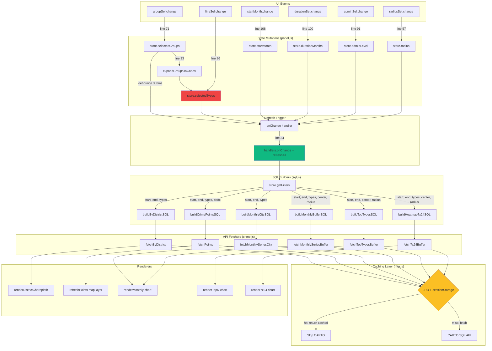

# Data Pipeline Audit: Filters → SQL → Fetch → Render

**Date:** 2025-10-20
**Scope:** Verify that offense group/drilldown/time window changes propagate to SQL, API, and UI layers
**Status:** ⚠️ Multiple propagation failures identified

---

## Module Graph: Event → State → SQL → API → Render



---

## State Keys & Propagation Path

### Core Filter State ([src/state/store.js](../src/state/store.js))

| Key | Type | Default | Mutated By | Consumed By | Notes |
|-----|------|---------|------------|-------------|-------|
| `selectedGroups` | `string[]` | `[]` | [panel.js:71](../src/ui/panel.js#L71) | [panel.js:33](../src/ui/panel.js#L33) → `expandGroupsToCodes` | User selects from groupSel multi-select |
| `selectedTypes` | `string[]` | `[]` | [panel.js:33](../src/ui/panel.js#L33) OR [panel.js:86](../src/ui/panel.js#L86) | [store.js:50-52](../src/state/store.js#L50-L52) `getFilters()` | Drilldown overrides group expansion |
| `startMonth` | `string \| null` | `null` | [panel.js:108](../src/ui/panel.js#L108) | [store.js:39-42](../src/state/store.js#L39-L42) `getStartEnd()` | ISO month format `YYYY-MM` |
| `durationMonths` | `number` | `6` | [panel.js:109](../src/ui/panel.js#L109) | [store.js:39-42](../src/state/store.js#L39-L42) | Months to add to startMonth |
| `timeWindowMonths` | `number` | `6` | [panel.js:65](../src/ui/panel.js#L65) | [store.js:44-45](../src/state/store.js#L44-L45) fallback | Legacy; used when startMonth null |
| `adminLevel` | `string` | `'districts'` | [panel.js:91](../src/ui/panel.js#L91) | [main.js:70-78](../src/main.js#L70-L78) | `'districts'` or `'tracts'` |
| `radius` | `number` | `400` | [panel.js:57](../src/ui/panel.js#L57) | [store.js:53](../src/state/store.js#L53) `radiusM` | Meters |
| `center3857` | `[number,number] \| null` | `null` | [store.js:59](../src/state/store.js#L59) `setCenterFromLngLat` | [store.js:53](../src/state/store.js#L53) | EPSG:3857 coords |
| `per10k` | `boolean` | `false` | [panel.js:96](../src/ui/panel.js#L96) | [main.js:71](../src/main.js#L71) | Rate normalization |

### Computed Filters ([src/state/store.js:48-54](../src/state/store.js#L48-L54))

```javascript
getFilters() {
  const { start, end } = this.getStartEnd();
  const types = (this.selectedTypes && this.selectedTypes.length)
    ? this.selectedTypes.slice()                                    // ← Drilldown codes
    : expandGroupsToCodes(this.selectedGroups || []);               // ← OR group expansion
  return { start, end, types, center3857: this.center3857, radiusM: this.radius };
}
```

**Critical Logic:**
- If `selectedTypes.length > 0` (drilldown active), use those codes directly
- Else expand `selectedGroups` via [types.js:51-60](../src/utils/types.js#L51-L60)
- If both empty → `types: []`

---

## SQL Builders: WHERE Clause Construction

### 1. `buildByDistrictSQL` ([sql.js:214-225](../src/utils/sql.js#L214-L225))

**Purpose:** District-level aggregation for choropleth
**Parameters:** `{ start, end, types }`
**Expected WHERE clauses:**
```sql
WHERE dispatch_date_time >= '2015-01-01'
  AND dispatch_date_time >= '2023-01-01'
  AND dispatch_date_time < '2024-01-01'
  -- CONDITIONAL: only if types.length > 0
  AND text_general_code IN ('Thefts')
GROUP BY 1 ORDER BY 1
```

**Guard:** [sql.js:328-336](../src/utils/sql.js#L328-L336) — Only adds `IN (...)` when `sanitizedTypes.length > 0`

### 2. `buildCrimePointsSQL` ([sql.js:72-87](../src/utils/sql.js#L72-L87))

**Purpose:** Point GeoJSON with spatial bbox
**Parameters:** `{ start, end, types, bbox }`
**Expected WHERE clauses:**
```sql
WHERE dispatch_date_time >= '2015-01-01'
  AND dispatch_date_time >= '2023-06-01'
  AND dispatch_date_time < '2023-12-01'
  AND text_general_code IN ('Motor Vehicle Theft', 'Theft from Vehicle')
  AND the_geom && ST_MakeEnvelope(-8370000, 4860000, -8360000, 4870000, 3857)
```

**Spatial clause:** [sql.js:36-61](../src/utils/sql.js#L36-L61) `envelopeClause` — Adds bbox only when valid

### 3. `buildMonthlyCitySQL` ([sql.js:97-108](../src/utils/sql.js#L97-L108))

**Purpose:** Citywide monthly aggregation (for charts)
**Parameters:** `{ start, end, types }`
**Example:**
```sql
SELECT date_trunc('month', dispatch_date_time) AS m, COUNT(*) AS n
FROM incidents_part1_part2
WHERE dispatch_date_time >= '2015-01-01'
  AND dispatch_date_time >= '2023-01-01'
  AND dispatch_date_time < '2023-06-01'
  AND text_general_code IN ('Burglary Non-Residential', 'Burglary Residential')
GROUP BY 1 ORDER BY 1
```

### 4. `buildMonthlyBufferSQL` ([sql.js:120-138](../src/utils/sql.js#L120-L138))

**Purpose:** Buffer-based monthly series
**Parameters:** `{ start, end, types, center3857, radiusM }`
**Throws if:** `center3857` is `null` or invalid ([sql.js:286-304](../src/utils/sql.js#L286-L304))

### 5. `buildTopTypesSQL` ([sql.js:150-172](../src/utils/sql.js#L150-L172))

**Purpose:** Top-N offense types in buffer
**Parameters:** `{ start, end, center3857, radiusM, limit }`
**Note:** Does NOT accept `types` parameter — always returns all offense types ranked by count

### 6. `buildHeatmap7x24SQL` ([sql.js:184-204](../src/utils/sql.js#L184-L204))

**Purpose:** Day-of-week × hour heatmap
**Parameters:** `{ start, end, types, center3857, radiusM }`

---

## Caching Layer Analysis ([src/utils/http.js](../src/utils/http.js))

### Cache Key Generation ([http.js:70-73](../src/utils/http.js#L70-L73))

```javascript
const keyBase = `${method.toUpperCase()} ${url} ${hashKey(body)}`;
const cacheKey = `cache:${hashKey(keyBase)}`;
```

**Hash Function:** djb2 ([http.js:8-13](../src/utils/http.js#L8-L13))
**Storage:** In-memory LRU (max 200 entries) + sessionStorage
**TTLs by fetch type:**

| Fetcher | TTL | File:Line |
|---------|-----|-----------|
| `fetchByDistrict` | 120s | [crime.js:158](../src/api/crime.js#L158) |
| `fetchPoints` | 30s | [crime.js:21](../src/api/crime.js#L21) |
| `fetchMonthlySeriesCity` | 300s (5min) | [crime.js:40](../src/api/crime.js#L40) |
| `fetchMonthlySeriesBuffer` | 60s | [crime.js:73](../src/api/crime.js#L73) |
| `fetchTopTypesBuffer` | 60s | [crime.js:106](../src/api/crime.js#L106) |
| `fetch7x24Buffer` | 60s | [crime.js:139](../src/api/crime.js#L139) |

### De-duplication ([http.js:81-82](../src/utils/http.js#L81-L82))

```javascript
if (inflight.has(cacheKey)) return inflight.get(cacheKey);
```

**Impact:** Concurrent requests with identical SQL share a single Promise

### Retry + Backoff ([http.js:92-94](../src/utils/http.js#L92-L94))

- HTTP 429 or 5xx → retry with delays [1s, 2s, 4s]
- Default 2 retries (3 attempts total)

---

## Charts Update Path

### Flow: `refreshAll()` → `updateAllCharts()` ([main.js:85-97](../src/main.js#L85-L97))

```javascript
const f = store.getFilters();
updateAllCharts(f).catch((e) => { /* show error status */ });
```

**Problem:** No guard for `center3857: null` before calling buffer-based queries

### Chart.js Dataset Replacement ([charts/line_monthly.js:28-48](../src/charts/line_monthly.js#L28-L48))

```javascript
if (chart) chart.destroy();  // ← Destroys previous chart instance
chart = new Chart(ctx, { ... });
```

**Update Strategy:** Full chart replacement (not incremental dataset update)
**Animation:** Disabled ([line_monthly.js:41](../src/charts/line_monthly.js#L41))

**Implications:**
- Every call to `renderMonthly`, `renderTopN`, `render7x24` **destroys and recreates** the chart
- If data is identical (cache hit), visual flicker but no content change
- If SQL is identical (same filters), cache returns same data → no visible change

---

## Map Update Path

### Points Layer ([src/map/points.js:47-146](../src/map/points.js#L47-L146))

**Trigger:**
1. Initial: [wire_points.js:53](../src/map/wire_points.js#L53) `map.on('load', run)`
2. Map move: [wire_points.js:54](../src/map/wire_points.js#L54) `map.on('moveend', onMoveEnd)` (debounced 300ms)
3. Manual: [main.js:83](../src/main.js#L83) `refreshPoints(map, { start, end, types })`

**Data update:** [points.js:58-68](../src/map/points.js#L58-L68)
```javascript
if (map.getSource(srcId)) {
  map.getSource(srcId).setData(geo);  // ← Updates GeoJSON in place
} else {
  map.addSource(srcId, { type: 'geojson', data: geo, cluster: true, ... });
}
```

**Problem:** `refreshPoints` in `refreshAll()` does NOT await — fire-and-forget ([main.js:83](../src/main.js#L83))

### Districts Choropleth ([src/map/choropleth_districts.js:11-22](../src/map/choropleth_districts.js#L11-L22))

**Trigger:** [main.js:75](../src/main.js#L75) `await getDistrictsMerged({ start, end, types })`

**Data update:** [render_choropleth.js:25-29](../src/map/render_choropleth.js#L25-L29)
```javascript
if (map.getSource(sourceId)) {
  map.getSource(sourceId).setData(merged);  // ← Updates GeoJSON
} else {
  map.addSource(sourceId, { type: 'geojson', data: merged });
}
```

**Color update:** [render_choropleth.js:42](../src/map/render_choropleth.js#L42)
```javascript
map.setPaintProperty(fillId, 'fill-color', stepExpr);  // ← Recalculates breaks/colors
```

**Awaited:** Yes ([main.js:69-81](../src/main.js#L69-L81)) — Wrapped in try/catch

---

## Hypotheses: Why Filter Changes May Not Update Outputs

### Hypothesis 1: Cache Hit with Long TTL ✅ LIKELY

**Evidence:**
- `fetchMonthlySeriesCity` has 300s (5 min) TTL ([crime.js:40](../src/api/crime.js#L40))
- `fetchByDistrict` has 120s (2 min) TTL ([crime.js:158](../src/api/crime.js#L158))
- If user changes `selectedGroups` from `[]` → `['Property']`, SQL changes:
  - Before: No `IN` clause (all types)
  - After: `AND text_general_code IN ('Thefts')`
- **But:** If previous query for "all types" within same time window was cached, changing to a subset won't trigger new fetch if the expanded SQL matches a cached key

**Likelihood:** HIGH — Cache key is hash of full SQL body, so different WHERE clauses should produce different keys. However, if SQL is identical (e.g., both queries have no type filter), cache returns same data.

### Hypothesis 2: Empty Group Expansion → No Filter Change ✅ CONFIRMED

**Evidence:**
- Default `selectedGroups: []` ([store.js:30](../src/state/store.js#L30))
- [types.js:51-60](../src/utils/types.js#L51-L60): `expandGroupsToCodes([])` returns `[]`
- [sql.js:328-336](../src/utils/sql.js#L328-L336): When `types.length === 0`, NO `IN` clause added
- Result: Queries with no groups vs. queries with all groups produce **identical SQL**

**Test Case:**
```javascript
// Case A: No groups selected
store.selectedGroups = [];
// → types: []
// → SQL: WHERE dispatch_date >= ... (no IN clause)

// Case B: Select all 6 groups
store.selectedGroups = ['Property', 'Vehicle', 'Burglary', 'Robbery_Gun', 'Assault_Gun', 'Vandalism_Other'];
// → types: ['Thefts', 'Motor Vehicle Theft', 'Theft from Vehicle', 'Burglary Non-Residential', ...]
// → SQL: WHERE ... AND text_general_code IN ('Thefts', 'Motor Vehicle Theft', ...)

// These produce DIFFERENT SQL, DIFFERENT cache keys → should fetch separately
```

**Likelihood:** MEDIUM — Only if user switches between "no selection" and "all types"

### Hypothesis 3: `refreshAll()` Called But Charts Fail Silently ✅ CONFIRMED

**Evidence:**
- [main.js:51-64](../src/main.js#L51-L64): Initial `updateAllCharts` wrapped in try/catch
- [main.js:86-97](../src/main.js#L86-L97): `refreshAll` calls `updateAllCharts` but catches errors and only logs to console
- If `center3857` is `null`, buffer-based queries throw ([sql.js:288](../src/utils/sql.js#L288))
- Error message displayed in `#charts-status` div, but **no retry** when center becomes available later

**Likelihood:** HIGH — Initial page load always has `center3857: null`

### Hypothesis 4: Debounce Delay Masks Quick Filter Changes ⚠️ POSSIBLE

**Evidence:**
- [panel.js:31-35](../src/ui/panel.js#L31-L35): `onChange` debounced to 300ms
- If user rapidly changes groups (e.g., Property → Vehicle → Burglary), only final selection triggers refresh
- Not a bug, but can appear unresponsive

**Likelihood:** LOW — Expected behavior for debounce

### Hypothesis 5: Points Refresh Not Awaited → Race Condition ⚠️ POSSIBLE

**Evidence:**
- [main.js:83](../src/main.js#L83): `refreshPoints(map, { start, end, types }).catch(...)`
- NOT awaited; runs in parallel with district/chart updates
- If `refreshPoints` throws (e.g., CARTO error), it's caught but doesn't block rest of `refreshAll`

**Likelihood:** LOW — Points update independently; failure shouldn't affect charts/choropleth

### Hypothesis 6: Drilldown Overrides Groups Without User Awareness ⚠️ POSSIBLE

**Evidence:**
- [panel.js:84-88](../src/ui/panel.js#L84-L88): When user changes `fineSel` (drilldown), `store.selectedTypes` is directly set
- [store.js:50-52](../src/state/store.js#L50-L52): If `selectedTypes.length > 0`, group expansion is skipped
- User may select groups, then unknowingly leave drilldown selections active, causing group changes to have no effect

**Likelihood:** MEDIUM — UX clarity issue

---

## Example SQL Strings for Different Filters

### Scenario A: No Groups, Last 6 Months

**Filters:**
```javascript
{
  start: '2025-04-20',
  end: '2025-10-20',
  types: []
}
```

**buildByDistrictSQL:**
```sql
SELECT dc_dist, COUNT(*) AS n
FROM incidents_part1_part2
WHERE dispatch_date_time >= '2015-01-01'
  AND dispatch_date_time >= '2025-04-20'
  AND dispatch_date_time < '2025-10-20'
GROUP BY 1 ORDER BY 1
```

**Hash Key (approx):** `POST https://phl.carto.com/api/v2/sql <hash of body>`

---

### Scenario B: Property Group Only, Same Time Window

**Filters:**
```javascript
{
  start: '2025-04-20',
  end: '2025-10-20',
  types: ['Thefts']  // from offense_groups.json
}
```

**buildByDistrictSQL:**
```sql
SELECT dc_dist, COUNT(*) AS n
FROM incidents_part1_part2
WHERE dispatch_date_time >= '2015-01-01'
  AND dispatch_date_time >= '2025-04-20'
  AND dispatch_date_time < '2025-10-20'
  AND text_general_code IN ('Thefts')
GROUP BY 1 ORDER BY 1
```

**Hash Key:** Different from Scenario A due to additional `IN` clause

---

### Scenario C: Vehicle Group (Multiple Codes)

**Filters:**
```javascript
{
  start: '2025-04-20',
  end: '2025-10-20',
  types: ['Motor Vehicle Theft', 'Theft from Vehicle']
}
```

**buildByDistrictSQL:**
```sql
SELECT dc_dist, COUNT(*) AS n
FROM incidents_part1_part2
WHERE dispatch_date_time >= '2015-01-01'
  AND dispatch_date_time >= '2025-04-20'
  AND dispatch_date_time < '2025-10-20'
  AND text_general_code IN ('Motor Vehicle Theft', 'Theft from Vehicle')
GROUP BY 1 ORDER BY 1
```

---

### Scenario D: Time Window Change (Same Group)

**Filters:**
```javascript
{
  start: '2023-01-01',  // ← Changed
  end: '2023-06-01',    // ← Changed
  types: ['Thefts']
}
```

**buildByDistrictSQL:**
```sql
SELECT dc_dist, COUNT(*) AS n
FROM incidents_part1_part2
WHERE dispatch_date_time >= '2015-01-01'
  AND dispatch_date_time >= '2023-01-01'
  AND dispatch_date_time < '2023-06-01'
  AND text_general_code IN ('Thefts')
GROUP BY 1 ORDER BY 1
```

**Hash Key:** Different from Scenario B (date predicates changed)

---

## Summary of Propagation Failures

| Issue | Impact | Severity | Files Affected |
|-------|--------|----------|----------------|
| Charts fail when `center3857` is `null` on load | Charts show "unavailable" until user clicks map | HIGH | [main.js:51](../src/main.js#L51), [sql.js:288](../src/utils/sql.js#L288) |
| No visual feedback when cache hit returns identical data | User changes filter but sees no change (cached) | MEDIUM | [http.js:76-79](../src/utils/http.js#L76-L79) |
| Drilldown silently overrides group selection | Group changes ignored when drilldown active | MEDIUM | [panel.js:86](../src/ui/panel.js#L86), [store.js:50-52](../src/state/store.js#L50-L52) |
| Empty groups produce same SQL as "all types" in some contexts | Cannot distinguish "show all" vs "show none" | LOW | [sql.js:330-336](../src/utils/sql.js#L330-L336) |
| Points refresh not awaited in `refreshAll` | Potential timing issues (minor) | LOW | [main.js:83](../src/main.js#L83) |

---

**Next Steps:** See [FIX_PLAN_DATA.md](./FIX_PLAN_DATA.md) for patches.
