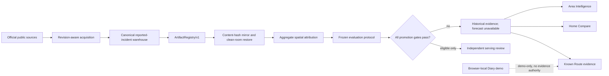
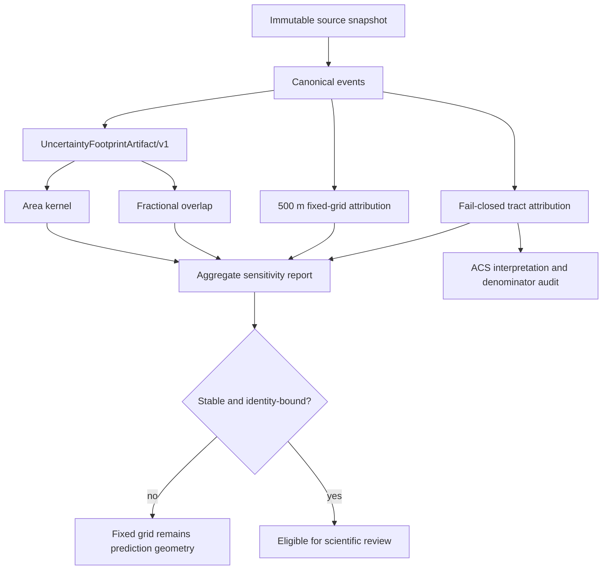
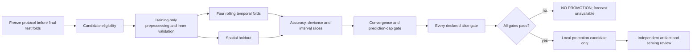

# Philadelphia Urban Evidence Lab — Portfolio v2

## System architecture

The dashed Diary connection is a user-experience seam only. Diary observations, Sample Community cards,
demo routes, and locally generated alternatives cannot satisfy a Known Route source receipt or any R7 gate.

## Data flow and trust boundaries

Every weighted row must have finite nonnegative weights that sum to one. Weighted assignments are separate
artifacts; canonical event records stay unchanged. Identity, coverage, geometry, or producer mismatch fails
closed instead of producing a best-effort number.

## Model eligibility and promotion

Simple baselines and ML implementations receive eligibility only. Neither a green unit test nor aggregate
metric improvement grants product promotion, scientific authority, serving, or deployment.

## Evidence inventory

| Evidence | Current bounded statement | Primary contract or entry point |
| --- | --- | --- |
| Reported incidents | Exact retained local receipt covers 3,586,620 canonical records | `ArtifactRegistry/v1`, warehouse receipt v3 |
| Evidence bundle | Approx. 10.81 GB retained local, content-addressed candidate | `scripts/lib/data_foundation_artifact_bundle/` |
| Restore | `file` and immutable `https`; object bytes/hash/rows re-observed | `scripts/restore_data_artifacts.mjs` |
| Spatial attribution | Tract, 500 m grid, fractional and area-kernel aggregate comparison | `scripts/lib/spatial_attribution_*` |
| Area Intelligence | Historical evidence available; forecast not promoted | `public/data/area_intelligence_baseline.v2.json` |
| Home Compare | Source-specific aggregate availability; private address session-only | `src/home_compare/`, lifecycle and join DQ contracts |
| Known Route | User-supplied route evidence; no safest route or combined score | `src/routes_crime/known_route_*` |
| Diary | Browser-local demo and static Sample Community only | `src/routes_diary/` |

## Restore and validation routes

- **Fixture gate:** contract, hostile-input, identity, privacy, and no-authority tests run without credentials.
- **Authorized full-data pipeline:** materialize the exact registry, mirror immutable objects, restore into a
  new caller-owned root, observe inventory, then validate downstream receipts.
- **Second environment:** a different environment identity must produce its own machine-readable restore
  receipt; copying a prior receipt is not observation.
- **Disaster drill:** missing and corrupted objects must both stop before downstream build; recovery records
  duration, downloaded bytes, verification outcome, and peak disk.
- **Scheduled maintenance:** a workflow configuration is not a run observation. Until a current scheduled
  receipt exists, status remains `unavailable`.

## Public product surfaces

1. **Area Intelligence** presents historical aggregate evidence and explicit no-promotion state.
2. **Home Compare** compares 2–4 locations using independent aggregate sources; source gaps remain visible.
3. **Known Route** explains evidence along a user-provided route while separating incidents, crashes,
   accessibility, mode legality, calibration, and sensitivity.

The future R7 decision is a machine-readable go/no-go gate only. It must not create route alternatives,
choose a winner, infer a safest route, or collapse dimensions into a combined safety score.
